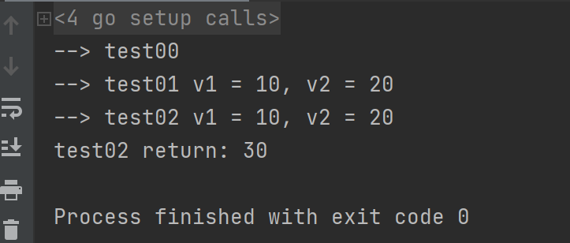
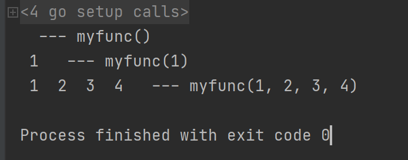

[TOC]

更多参见：[从0开始学GO之目录](https://blog.csdn.net/leacock1991/article/details/112853343)


## 函数定义与调用

函数构成代码执行的逻辑结构。在Go语言中，函数的基本组成为：关键字func、函数名、参数列表、返回值、函数体和返回语句。

Go 语言函数定义格式如下：

```go
func function_name( [parameter list] ) [return_types] {
   函数体
}
```

- func：函数由 func 开始声明
- function_name：函数名称，函数名和参数列表一起构成了函数签名。
- parameter list：参数列表，参数就像一个占位符，当函数被调用时，你可以将值传递给参数，这个值被称为实际参数。参数列表指定的是参数类型、顺序、及参数个数。参数是可选的，也就是说函数也可以不包含参数。
- return_types：返回类型，函数返回一列值。return_types 是该列值的数据类型。有些功能不需要返回值，这种情况下 return_types 不是必须的。
- 函数体：函数定义的代码集合。


```go
package main
import "fmt"

func test00() {
	fmt.Println("--> test00")
}

func test01(v1 int, v2 int) { //方式1
	fmt.Printf("--> test01 v1 = %d, v2 = %d\n", v1, v2)
}

func test02(v1, v2 int) int { //方式2, v1, v2都是int类型
	fmt.Printf("--> test02 v1 = %d, v2 = %d\n", v1, v2)
	return v1+v2
}

func main() {
	test00()
	test01(10, 20)
	fmt.Println("test02 return:",test02(10,20))
}
```




注：小写字母开头的函数只在本包内可见，大写字母开头的函数才能被其他包使用。这个规则也适用于类型和变量的可见性。  


## 不定参数

不定参数是指函数传入的参数个数为不定数量 。为了做到这点，需要将函数定义为接受不定参数类型：

```go
func myfunc(args ...int) {
	for _, arg := range args {
		...
	}
}
```

形如...type格式的类型只能作为函数的参数类型存在，并且必须是最后一个参数。它是一个语法糖（ syntactic sugar）。从内部实现机理上来说，类型...type本质上是一个**数组切片**，也就是[]type，这也是为什么上面的参数args可以用for循环来获得每个传入的参数。  

```go
package main
import "fmt"

func myfunc(args ...int) string{
	for _, arg := range args {
		fmt.Printf(" %d ",arg)
	}
	return ""
}

func main() {
	//函数调用，可传0到多个参数
	fmt.Println( myfunc()," --- myfunc()")
	fmt.Println( myfunc(1), " --- myfunc(1)")
	fmt.Println( myfunc(1, 2, 3, 4), " --- myfunc(1, 2, 3, 4)")
}
```




### 不定参数的传递  

```go
package main
import "fmt"

func myfunc(args ...int) {
	// 按原样传递
	myfunc1(args...)
	fmt.Printf("\n------------\n")
	// 传递片段，实际上任意的int slice都可以传进去
	myfunc1(args[1:]...) // 不定参数个数要大于1个
}
func myfunc1(args ...int) string{
	for _, arg := range args {
		fmt.Printf(" %d ",arg)
	}
	return ""
}
func main() {

	// myfunc() // err panic: runtime error: slice bounds out of range [1:0]
	myfunc(1,2,3,4)
}
```

输出：

```
 1  2  3  4 
------------
 2  3  4 
Process finished with exit code 0
```


### 任意类型的不定参数 

如果希望传任意类型，可以指定类型为interface{}。  

Go语言标准库中fmt.Printf()的函数原型就使用了 interface。interface 接口 见后续文章

```go
func Printf(format string, args ...interface{}) {
// ...
}
```

```go
package main

import "fmt"

func checkType(args ...interface{}) {
	for _, arg := range args {
		switch arg.(type) {
		case int32:
			fmt.Println(arg, "is an int32 value.")
		case int64:
			fmt.Println(arg, "is an int64 value.")
		case int: // 与 C/C++不同，自带 break功能，一个case结束后不再继续
				fmt.Println(arg, "is an int value.")
		case string:
			fmt.Println(arg, "is an string value.")
		case float32:
			fmt.Println(arg, "is an float32 value.")
		case float64:
			fmt.Println(arg, "is an float64 value.")
		case bool:
			fmt.Println(arg, "is an bool value.")
		default:
			fmt.Println(arg, "is an Unknown value.")
		}
	}
}

func main() {
	a := 1
	b := 2.0
	var c float32 = 3.0
	d := "Hello World"
	e := true
	var f int64 = 4
	checkType(a,b,c,d,e,f)

}
```


## 参数类型

| 传递类型 | 描述                                                         |
| :------- | :----------------------------------------------------------- |
| 值传递   | 值传递是指在调用函数时将实际参数复制一份传递到函数中，这样在函数中如果对参数进行修改，将不会影响到实际参数。 |
| 引用传递 | 引用传递是指在调用函数时将实际参数的地址传递到函数中，那么在函数中对参数所进行的修改，将影响到实际参数。 |

默认情况下，Go 语言使用的是**值传递**，即在调用过程中不会影响到实际参数。


```go
package main

import "fmt"

func swap(a interface{}  , b *interface{} ) {
	a, *b = *b, a
}

func main() {
	var a interface{} = "Hello"
	var b interface{} = 3.14
	fmt.Println("before a = ", a)
	fmt.Println("before b = ", b)
	swap(a,&b)
	fmt.Println("after a = ", a)
	fmt.Println("after b = ", b)

	fmt.Println("-------------- ")

	a = 3.14
	b = "Hello"
	fmt.Println("before a = ", a)
	fmt.Println("before b = ", b)
	swap(a,&b)
	fmt.Println("after a = ", a)
	fmt.Println("after b = ", b)
}
```


## 多返回值

Go语言的函数或者成员的方法可以有多个返回值，这一点 和Python类似但有别于C、 C++和Java等开发语言 。

Python示例：

```python
def func():
    return 123, "Hello World"

if __name__ == '__main__':
    var1,var2 = func()
    print(type(var1), var1)
    print(type(var2), var2)
```

输出：


Go语言中比如 `File.Read()` 函数就可以同时返回读取的字节数和错误信息。如果读取文件成功，则返回值中的n为读取的字节数， err为nil，否则err为具体的出错信息：
`func (file *File) Read(b []byte) (n int, err Error)  `

可以给返回值命名，就像函数的输入参数一样 ,返回值被命名之后，它们的值在函数开始的时候被自动初始化为空。  在函数中执行不带任何参数的return语句时，会返回对应的返回值变量的值。  Go语言并不需要强制命名返回值，但是命名后的返回值可以让代码更清晰 。对于多个返回值，不想关心其中的某个返回值，可以简单地用一个下划线“_”来跳过这个返回值。

```go
package main
import "fmt"

func myfunc(a int , b interface{}, c string) (a1 int,b1 interface{},c1 interface{}){

	fmt.Println("a = ", a)
	fmt.Println("b = ", b)
	fmt.Println("c = ", c)
	fmt.Println("-----")
	fmt.Println("a1 = ", a1)  // 自动初始化为空
	fmt.Println("b1 = ", b1)
	fmt.Println("c1 = ", c1)

	return a,b,len(c)
}

func main() {
	a := 1
	b := 2.0
	c := "Hello World"
	aa,bb,cc := myfunc(a,b,c)
	fmt.Println("-----")
	fmt.Println("aa = ", aa)
	fmt.Println("bb = ", bb)
	fmt.Println("cc = ", cc)
	fmt.Println("=============")
	i := 2
	j := "Hello World"
	k := "Go..."
	ii,jj,kk := myfunc(i,j,k)
	fmt.Println("-----")
	fmt.Println("ii = ", ii)
	fmt.Println("jj = ", jj)
	fmt.Println("kk = ", kk)
}
```


## 匿名函数与闭包

### 匿名函数

匿名函数是指不需要定义函数名的一种函数实现方式 。在Go里面，函数可以像普通变量一样被传递或使用  。

匿名函数由一个不带函数名的函数声明和函数体组成  ：

```go
func(a, b int, z float64) bool {
	return a*b <int(z)
}
```

匿名函数可以直接赋值给一个变量或者直接执行  

```go
package main

import "fmt"

type FuncType func(int, int) int //声明一个函数类型, func后面没有函数名

func main() {
	f := func(a, b int) int {
		return a + b
	}
	var g FuncType = func(a, b int) int {
		return a - b
	}

	ff := f(11,22)
	gg := g(11,22)

	fmt.Println("ff = ",ff)
	fmt.Println("gg = ",gg)

	stringTmp := func(a,b string) string {
		return a + " " + b
	} ("Hello","World")
	fmt.Println("string_tmp = ", stringTmp)
}
```


### 闭包

所谓闭包就是一个函数“捕获”了和它在同一作用域的其它常量和变量。这就意味着当闭包被调用的时候，不管在程序什么地方调用，闭包能够使用这些常量或者变量。它不关心这些捕获了的变量和常量是否已经超出了作用域，所以**只有闭包还在使用它，这些变量就还会存在**。在Go语言里，所有的匿名函数都是闭包。

闭包捕获外部变量：

```go
package main

import "fmt"

func main() {
	var j = 5
	var i = 1
	a := func() func() {
		var i = 10 // 局部变量 在 匿名函数中起作用
		return func() {
			j++
			i += 2
			fmt.Printf("in i, j: %d, %d\n", i, j)
		}
	}() // 这个（） 用于 里面的匿名函数的执行
	a() // 捕获了和它在同一作用域的其它变量 j , 匿名函数对其改变会影响后面
	fmt.Printf("out i, j: %d, %d\n", i, j)
	j *= 2
	i += 2
	a() // 闭包还在使用 i ，变量 i 就还会存在 所以 匿名函数中 局部变量 i 会累加
	fmt.Printf("out i, j: %d, %d\n", i, j)
}
```


个人能力有限，如有错误或者其他建议，敬请告知欢迎探讨，谢谢!
