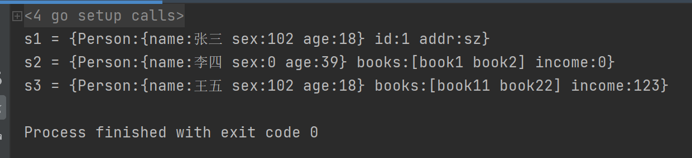
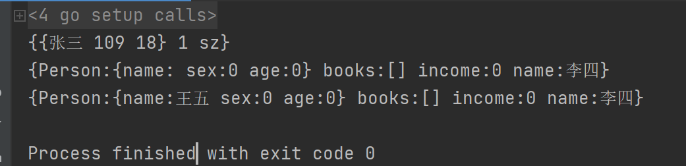
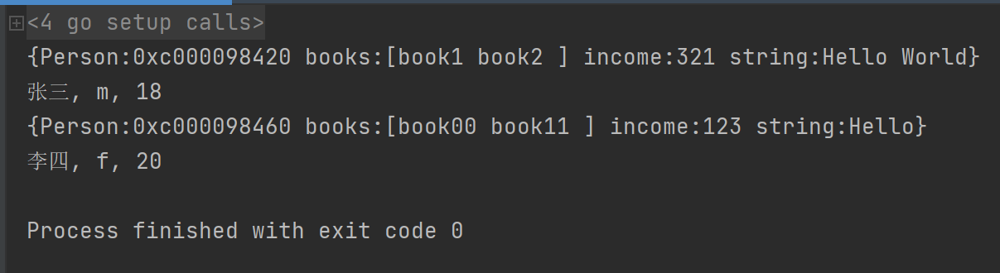
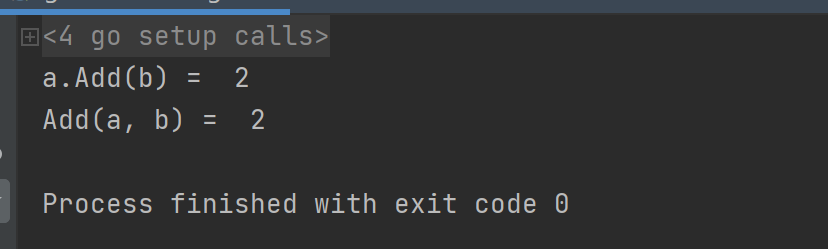
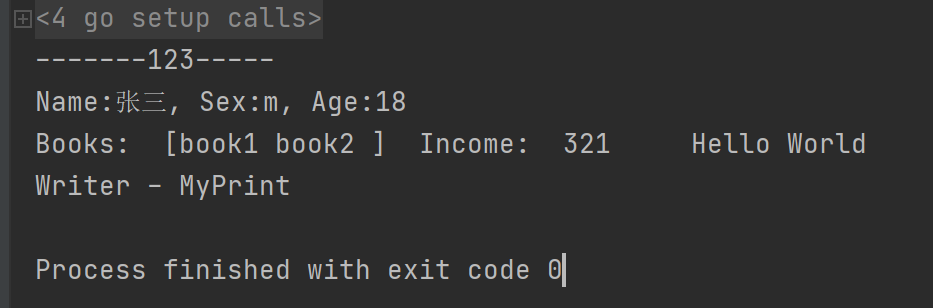
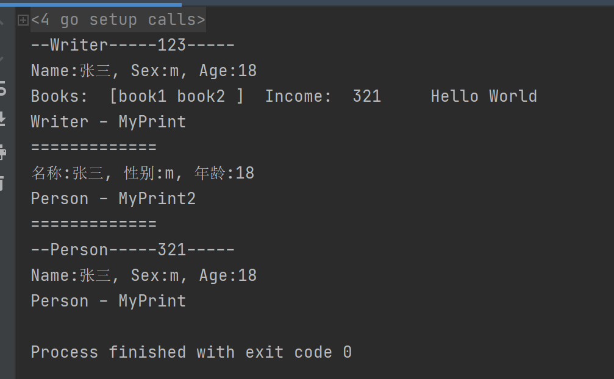

[TOC]

更多参见：[从0开始学GO之目录](https://blog.csdn.net/leacock1991/article/details/112853343)


## 匿名组合

### 匿名字段与初始化

**只提供类型，而不写字段名的方式**，就是匿名字段，也称为嵌入字段。一般情况下，定义结构体的时候是字段名与其类型一一对应。

当**匿名字段**也是一个**结构体**的时候，那么这个**结构体所拥有的全部字段都被隐式地引入了当前定义的这个结构体**。

```go
package main

import "fmt"

//人
type Person struct {
	name string
	sex  byte
	age  int
}

//学生
type Student struct {
	Person // 匿名字段，那么默认Student就包含了Person的所有字段
	id     int
	addr   string
}

//作家
type Writer struct {
	Person // 匿名字段
	books []string
	income int
}

func main() {
	//顺序初始化
	s1 := Student{Person{"张三", 'f', 18}, 1, "sz"}
	fmt.Printf("s1 = %+v\n", s1)  //  %+v   添加字段名(如结构体)
	//部分成员初始化1
	s2 := Writer{Person: Person{name:"李四", age: 39}, books :[]string {"book1","book2"}}
	fmt.Printf("s2 = %+v\n", s2)
	//顺序初始化
	s3 := Writer{Person{"王五", 'f', 18}, []string {"book11","book22"}, 123}
	fmt.Printf("s3 = %+v\n", s3)
}

```



### 成员的操作

成员赋值以及同名字段

```go
package main

import "fmt"

//人
type Person struct {
	name string
	sex  byte
	age  int
}

//学生
type Student struct {
	Person // 匿名字段，那么默认Student就包含了Person的所有字段
	id     int
	addr   string
}

//作家
type Writer struct {
	Person // 匿名字段
	books []string
	income int
	name string // 和Person中的name同名 同名字段
}

func main() {
	var s1 Student //变量声明
	//给成员赋值
	s1.name = "张三" //等价于 s1.Person.name = "张三"
	s1.sex = 'm'
	s1.age = 18
	// s1.Person = Person{"张三", 'm', 18}
	s1.id = 1
	s1.addr = "sz"
	fmt.Println(s1) // {{张三 109 18} 1 sz}

	var w1 Writer //变量声明
	//给 Writer 的name，还是给Person赋值？
	w1.name = "李四"
	fmt.Printf("%+v\n", w1) // {Person:{name: sex:0 age:0} books:[] income:0 name:李四}

	//默认只会给最外层的成员赋值
	//给匿名同名成员赋值，需要显示调用
	w1.Person.name = "王五"
	fmt.Printf("%+v\n", w1) // {Person:{name:王五 sex:0 age:0} books:[] income:0 name:李四}
}
```




### 其它匿名字段

所有的**内置类型**、**自定义类型** 以及 **结构体指针类型** 都是可以作为匿名字段的：

```go
package main

import "fmt"

//人
type Person struct {
	name string
	sex  byte
	age  int
}

type income int //自定义类型

//作家
type Writer struct {
	*Person // 匿名字段，结构体指针类型
	books [3]string
	income // 匿名字段，自定义类型
	string // 匿名字段， 内置类型
}

func main() {
	//初始化
	w1 := Writer{&Person{"张三", 'm', 18}, [3]string{"book1","book2"}, 321,"Hello World"}
	fmt.Printf("%+v\n", w1)
	fmt.Printf("%s, %c, %d\n", w1.name, w1.sex, w1.age)

	var w2 Writer
	w2.Person = new(Person) //先 分配空间
	w2.name = "李四"
	w2.sex = 'f'
	w2.age = 20

	//w2.books = []string{"book11","book22"}
	w2.books[0] = "book00"
	w2.books[1] = "book11"
	w2.income = 123
	w2.string = "Hello"

	fmt.Printf("%+v\n", w2)
	fmt.Printf("%s, %c, %d\n", w2.name, w2.sex, w2.age)
}
```




## 方法


在面向对象编程中，一个对象其实也就是一个简单的值或者一个变量，在这个对象中会包含一些函数，这种**带有接收者的函数，我们称为方法(method)**。 本质上，一个方法则是一个和特殊类型关联的函数。

一个面向对象的程序会用方法来表达其属性和对应的操作，这样使用这个对象的用户就不需要直接去操作对象，而是借助方法来做这些事情。

在Go语言中，可以给任意**自定义类型**（包括内置类型，但不包括指针类型）添加相应的方法。

**⽅法总是绑定对象实例，并隐式将实例作为第⼀实参 (receiver)**

```go
func (receiver ReceiverType) funcName(parameters) (results)
```

- 参数 receiver 可任意命名。如⽅法中未曾使⽤，可省略参数名。
- 参数 receiver 类型可以是 T 或 *T。基类型 T 不能是接⼝或指针。
- 不支持重载方法，也就是说，不能定义名字相同但是不同参数的方法。

### 为类型添加方法

**为基础类型添加方法**

```go
package main

import "fmt"

type MyInt int //自定义类型，给int改名为MyInt

//在函数定义时，在其名字之前放上一个变量，即是一个方法
func (a MyInt) Add(b MyInt) MyInt { //面向对象
	return a + b
}

//传统方式的定义
func Add(a, b MyInt) MyInt { //面向过程
	return a + b
}

func main() {
	var a MyInt = 1
	var b MyInt = 1
	//调用func (a MyInt) Add(b MyInt)
	fmt.Println("a.Add(b) = ", a.Add(b)) //a.Add(b) =  2
	//调用func Add(a, b MyInt)
	fmt.Println("Add(a, b) = ", Add(a, b)) //Add(a, b) =  2
}
```




**为结构体添加方法**

```go
package main

import "fmt"

//人
type Person struct {
	name string
	sex  byte
	age  int
}

type income int //自定义类型

//作家
type Writer struct {
	*Person // 匿名字段，结构体指针类型
	books [3]string
	income // 匿名字段，自定义类型
	string // 匿名字段， 内置类型
}


func (w Writer) MyPrint(n int) string{
	fmt.Printf("-------%d-----\n",n)
	fmt.Printf("Name:%s, Sex:%c, Age:%d\n", w.name, w.sex, w.age)
	fmt.Println("Books: ", w.books, "\tIncome: ",w.income,"\t",w.string)
	return "Writer - MyPrint"
}

func main() {
	//初始化
	w1 := Writer{&Person{"张三", 'm', 18}, [3]string{"book1","book2"}, 321,"Hello World"}
	fmt.Println(w1.MyPrint(123))
}
```




### 值语义和引用语义

参见： [从0开始学GO之函数](https://blog.csdn.net/leacock1991/article/details/112973170)


### 匿名字段方法的继承与重写

如果匿名字段实现了一个方法，那么包含这个匿名字段的struct也能调用该方法。匿名字段中的同名方法需要显示调用。

```go
package main

import "fmt"

//人
type Person struct {
	name string
	sex  byte
	age  int
}

type income int //自定义类型

//作家
type Writer struct {
	*Person // 匿名字段，结构体指针类型
	books [3]string
	income // 匿名字段，自定义类型
	string // 匿名字段， 内置类型
}

func (p Person)MyPrint(n int) string { // Person 方法
	fmt.Printf("--Person-----%d-----\n",n)
	fmt.Printf("Name:%s, Sex:%c, Age:%d\n", p.name, p.sex, p.age)
	return "Person - MyPrint"
}
func (p Person)MyPrint2() string{ // Person 方法
	fmt.Printf("名称:%s, 性别:%c, 年龄:%d\n", p.name, p.sex, p.age)
	return "Person - MyPrint2"
}


func (w Writer) MyPrint(n int) string{ // Writer 方法
	fmt.Printf("--Writer-----%d-----\n",n)
	fmt.Printf("Name:%s, Sex:%c, Age:%d\n", w.name, w.sex, w.age)
	fmt.Println("Books: ", w.books, "\tIncome: ",w.income,"\t",w.string)
	return "Writer - MyPrint"
}

func main() {
	//初始化
	w1 := Writer{&Person{"张三", 'm', 18}, [3]string{"book1","book2"}, 321,"Hello World"}
	fmt.Println(w1.MyPrint(123)) // 重写
	fmt.Println("=============")
	fmt.Println(w1.MyPrint2())  //  继承
	fmt.Println("=============")
	fmt.Println(w1.Person.MyPrint(321))
}
```





个人能力有限，如有错误或者其他建议，敬请告知欢迎探讨，谢谢!