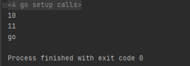

[TOC]

更多参见：[从0开始学GO之目录](https://blog.csdn.net/leacock1991/article/details/112853343)

## 变量

**变量**几乎所有编程语言最基础的组成元素。从根本上说，变量相当于是对一块数据存储空间的命名，程序可以通过定义一个变量来申请一块数据存储空间，之后可以通过引用变量名来使用这块存储空间。


### 变量声明

Go语言引入了关键字 `var`，而类型信息放在变量名之后，变量声明语句不需要使用分号作为结束符。

```go
	var v1 string
	var v2 [5]int // 数组
	var v3 struct {
		s1 int
		s2 string
	}
	var v4 *int // 指针
	var v5 map[string]int // map，key为string类型，value为int类型
	var v6 func(a int) int
	//一次定义多个变量
	var v7 , v8 int // 同类型

	var (
		v5 string
		v6 int
	)
```


### 变量初始化

对于声明变量时需要进行初始化的场景， `var` 关键字可以保留，但不再是必要的元素

```go
	var v1 int = 10 
	var v2 = 10 // 编译器自动推导出v2的类型
	v3 := 10 // 编译器可以自动推导出v3的类型
	// 以上三种用法的效果是完全一样的
	//出现在 := 左侧的变量不应该是已经被声明过
	var i int
	i := 2 //err
```

### 变量赋值

```go
	var v1 int
	v1 = 123
	var v2, v3, v4 int
	v2, v3, v4 = 1, 2, 3    //多重赋值

	i := 10
	j := 20
	i, j = j+1, i+1   //多重赋值
```

多重赋值形式上像Python


### 匿名变量

_（下划线）任何赋予它的值都会被丢弃：

```go
package main
import "fmt"

func test() (int, string) {
	return 250, "go"
}

func main() {
	i := 10
	j := 20
	_, j = j+1, i+1   //多重赋值
	fmt.Println(i)
	fmt.Println(j)
	var str string
	_, str = test()
	fmt.Println(str)
}
```





## 常量

常量是指编译期间就已知且不可改变的值。常量可以是数值类型（包括整型、浮点型和复数类型）、布尔类型、字符串类型等。

### 字面常量

所谓字面常量（literal），是指程序中硬编码的常量

```go
-12 
3.14159265358979323846 // 浮点类型的常量
3.2+12i // 复数类型的常量
true // 布尔类型的常量
"foo" // 字符串常量
```

### 常量定义

通过` const ` 关键字，进行定义。常量定义可以限定常量类型，但不是必需的。如果定义常量时没有指定类型，那么它与字面常量一样，是无类型常量。

```go
	const Pi float64 = 3.14
	const zero = 0.0 // 无类型浮点常量
	const (
		size int64 = 1024
		eof        = -1 // 整型常量, 自动推导类型
	)
	const a, b, c = 3, 4, "go"
	const mask = 1 << 3
```


### 预定义常量

Go语言预定义了这些常量：**true、false和iota**。

常量声明可以使用iota常量生成器初始化，它用于生成一组以相似规则初始化的常量，但是不用每行都写一遍初始化表达式。可以被认为是一个可被编译器修改的常量，在每一个const关键字出现时被重置为0，然后在下一个const出现之前，每出现一次iota，其所代表的数字会自动增1。


```go
	const ( // iota被重设为0
		c0 = iota // c0 == 0
		c1 = iota // c1 == 1
		c2 = iota // c2 == 2
	)
	const ( // iota被重设为0
		c3 = iota // c3 == 0
		c4  	 // c4 == 1
		c5 		 // c5 == 2
	)
	const (
		a = 1 << iota // a == 1 (iota在每个const开头被重设为0)
		b = 1 << iota // b == 2
		c = 1 << iota // c == 4
	)
```

### 枚举

枚举指一系列相关的常量。Go语言并不支持众多其他语言明确支持的enum关键字。可以通过 `const + iota` 进行枚举表示

```go
	const (
		Sunday = iota
		Monday
		Tuesday
		Wednesday
		Thursday
		Friday
		Saturday
		numberOfDays // 这个常量没有导出包内私有
	)
```

以大写字母开头的常量在包外可见，以上numberOfDays为包内私有，其他符号则可被其他包访问。


个人能力有限，如有错误或者其他建议，敬请告知欢迎探讨，谢谢!