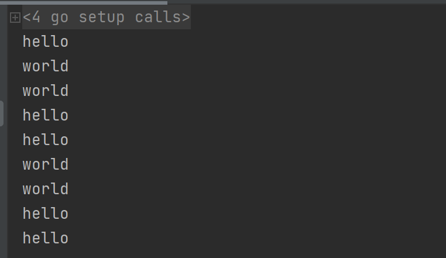
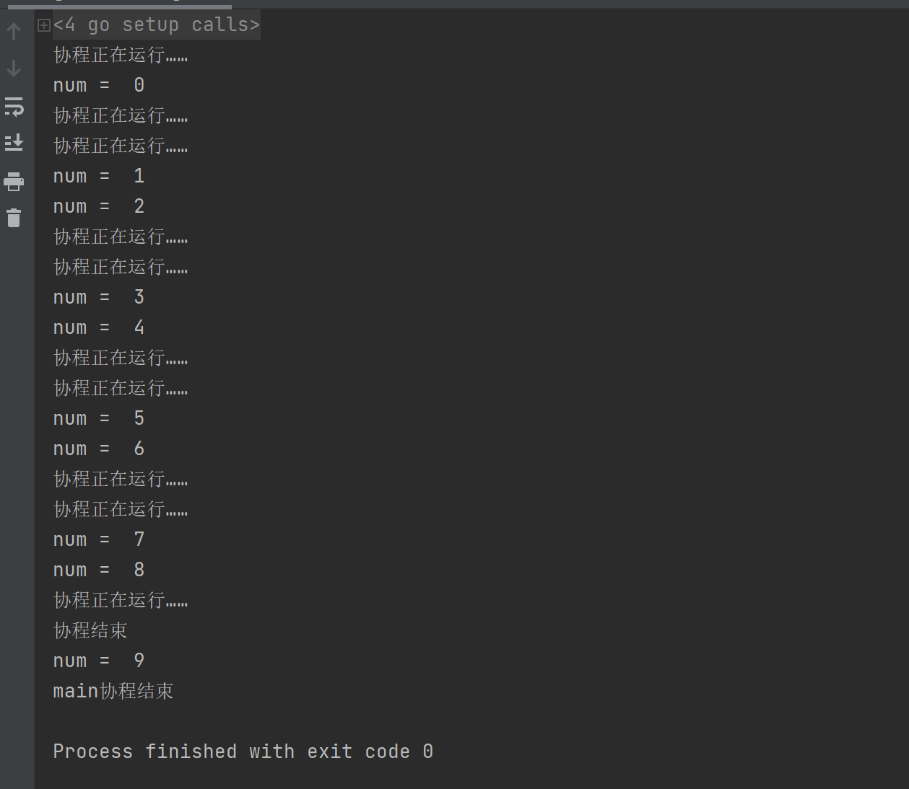
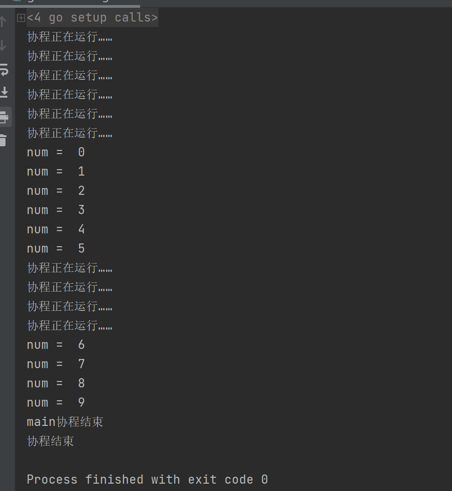
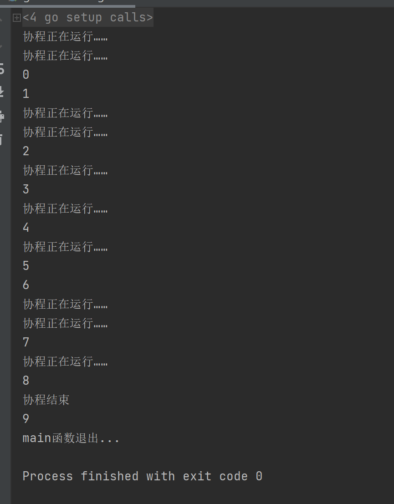

[TOC]

更多参见：[从0开始学GO之目录](https://blog.csdn.net/leacock1991/article/details/112853343)

## goroutine

Go 语言支持并发，我们只需要通过 go 关键字来开启 goroutine 即可。

goroutine 是轻量级线程，goroutine 的调度是由 Golang 运行时进行管理的。

goroutine 语法格式：

```go
go 函数名( 参数列表 )
```

例如：

```go
go f(x, y, z)
```

开启一个新的 goroutine:

```go
f(x, y, z)
```

```go
package main
import (
        "fmt"
        "time"
)
func say(s string) {
        for i := 0; i < 5; i++ {
                time.Sleep(100 * time.Millisecond)
                fmt.Println(s)
        }
}
func main() {
        go say("world")
        say("hello")
}
```



主goroutine退出后，其它的工作goroutine也会自动退出：

```go
package main
import (
	"fmt"
	"time"
)
func say(s string) {
	for i := 0; i < 5; i++ {
		time.Sleep(2 * time.Second)
		fmt.Println(s)
	}
}
func main() {
	go say("world")
	//say("hello")
	fmt.Println("main goroutine exit")
}
```

```
main goroutine exit

Process finished with exit code 0
```


## channel

通道（channel）是用来传递数据的一个数据结构。

通道可用于两个 goroutine 之间通过传递一个指定类型的值来同步运行和通讯。操作符 <- 用于指定通道的方向，发送或接收。如果未指定方向，则为双向通道。

定义一个channel时，也需要定义发送到channel的值的类型。channel可以使用内置的make()函数来创建：

```go
make(chan Type) //等价于make(chan Type, 0)
make(chan Type, capacity)
```


channel通过操作符<-来接收和发送数据，发送和接收数据语法：

```go
channel <- value      //发送value到channel
<-channel             //接收并将其丢弃
x := <-channel        //从channel中接收数据，并赋值给x
x, ok := <-channel    //功能同上，同时检查通道是否已关闭或者是否为空
```
默认情况下，channel接收和发送数据都是阻塞的，除非另一端已经准备好，这样就使得goroutine同步变的更加的简单，而不需要显式的lock。

```go
package main
import (
	"fmt"
	"time"
)
func main() {
	c := make(chan int)
	go func() {
		defer fmt.Println("协程结束")
		for i := 0; i < 10; i++ {
			fmt.Println("协程正在运行……")
			c <- i //i发送到c
		}

	}()
	time.Sleep(5*time.Second)
	for i := 0; i < 10; i++ {
		num := <-c //从c中接收数据，并赋值给num
		fmt.Println("num = ", num)
	}
	fmt.Println("main协程结束")
}
```



可以看到会在打印一条 协程正在运行…… 后等待5秒

### **无缓冲的channel:**

无缓冲的通道（unbuffered channel）是指在接收前没有能力保存任何值的通道。

这种类型的通道要求发送 goroutine 和接收 goroutine 同时准备好，才能完成发送和接收操作。如果两个goroutine没有同时准备好，通道会导致先执行发送或接收操作的 goroutine 阻塞等待。


### **有缓冲的channel：**

有缓冲的通道（buffered channel）是一种在被接收前能存储一个或者多个值的通道。

这种类型的通道并不强制要求 goroutine 之间必须同时完成发送和接收。通道会阻塞发送和接收动作的条件也会不同。只有在通道中没有要接收的值时，接收动作才会阻塞。只有在通道没有可用缓冲区容纳被发送的值时，发送动作才会阻塞。
对上面代码稍加修改

```go
package main
import (
	"fmt"
	"time"
)
func main() {
	c := make(chan int, 5)
	go func() {
		defer fmt.Println("协程结束")
		for i := 0; i < 10; i++ {
			fmt.Println("协程正在运行……")
			c <- i //i发送到c
		}

	}()
	time.Sleep(5*time.Second)
	for i := 0; i < 10; i++ {
		num := <-c //从c中接收数据，并赋值给num
		fmt.Println("num = ", num)
	}
	fmt.Println("main协程结束")
}
```




可以看到会在打印六条 协程正在运行…… 后等待5秒 

### 遍历通道与关闭通道

Go 通过 range 关键字来实现遍历读取到的数据，类似于与数组或切片

```go
v, ok := <-ch
```

如果通道接收不到数据后 ok 就为 false，这时通道就可以使用 close() 函数来关闭。

只要chan被关闭了，就会退出for循环。

```Go
for item := range chan {
    ......
}
```

```go
package main
import (
	"fmt"
	"time"
)
func test(n int, c chan int) {
	defer fmt.Println("协程结束")
	for i := 0; i < n; i++ {
		fmt.Println("协程正在运行……")
		time.Sleep(time.Second)
		c <- i //i发送到c
	}
	close(c)
}
func main() {
	c := make(chan int, 10)
	go test(cap(c), c)

	for i := range c {
		fmt.Println(i)
	}
	fmt.Println("main函数退出...")
}
```




如果屏蔽掉 close(c) 会报错

fatal error: all goroutines are asleep - deadlock!


个人能力有限，如有错误或者其他建议，敬请告知欢迎探讨，谢谢!

