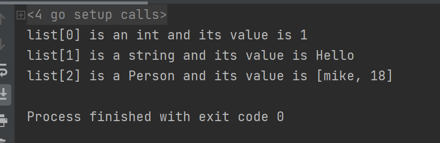
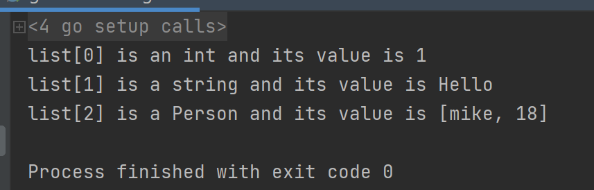

[TOC]

更多参见：[从0开始学GO之目录](https://blog.csdn.net/leacock1991/article/details/112853343)


Go语言的接口并不是其他语言（ C++、 Java等）中所提供的接口概念 ，其他语言中实现类需要时要明确声明自己实现了某个接口。  

在Go语言中，接口(interface)是一个自定义类型，接口类型具体描述了一系列方法的集合。一个类只需要实现了接口要求的所有函数，我们就说这个类实现了该接口  。Go通过接口实现了鸭子类型(duck-typing)，我们并不关心对象是什么类型，到底是不是鸭子，只关心行为。鸭子类型(duck-typing)  可参见 [C++泛型与多态（4）：Duck Typing](https://blog.csdn.net/leacock1991/article/details/111500530)

参考 [https://blog.csdn.net/tennysonsky/article/details/78931630](https://blog.csdn.net/tennysonsky/article/details/78931630)


## 接口的使用

### 接口定义

```
type Humaner interface {
    SayHi()
}
```

- 接口只有方法声明，没有实现，没有数据字段
- 接口可以匿名嵌入其它接口，或嵌入到结构中

### 接口实现

接口是用来定义行为的类型。**这些被定义的行为不由接口直接实现，而是由用户定义的类型实现**，一个实现了这些方法的具体类型是这个接口类型的实例。

如果用户定义的类型实现了某个接口类型声明的一组方法，那么这个用户定义的类型的值就可以赋给这个接口类型的值。这个赋值会把用户定义的类型的值存入接口类型的值。

```go
type Humaner interface {
    SayHi()
}

type Student struct { //学生
    name  string
    score float64
}

//Student实现SayHi()方法
func (s *Student) SayHi() {
    fmt.Printf("Student[%s, %f] say hi!!\n", s.name, s.score)
}

type Teacher struct { //老师
    name  string
    group string
}

//Teacher实现SayHi()方法
func (t *Teacher) SayHi() {
    fmt.Printf("Teacher[%s, %s] say hi!!\n", t.name, t.group)
}

type MyStr string

//MyStr实现SayHi()方法
func (str MyStr) SayHi() {
    fmt.Printf("MyStr[%s] say hi!!\n", str)
}

//普通函数，参数为Humaner类型的变量i
func WhoSayHi(i Humaner) {
    i.SayHi()
}

func main() {
    s := &Student{"mike", 88.88}
    t := &Teacher{"yoyo", "Go语言"}
    var tmp MyStr = "测试"

    s.SayHi()   //Student[mike, 88.880000] say hi!!
    t.SayHi()   //Teacher[yoyo, Go语言] say hi!!
    tmp.SayHi() //MyStr[测试] say hi!!

    //多态，调用同一接口，不同表现
    WhoSayHi(s)   //Student[mike, 88.880000] say hi!!
    WhoSayHi(t)   //Teacher[yoyo, Go语言] say hi!!
    WhoSayHi(tmp) //MyStr[测试] say hi!!

    x := make([]Humaner, 3)
    //这三个都是不同类型的元素，但是他们实现了interface同一个接口
    x[0], x[1], x[2] = s, t, tmp
    for _, value := range x {
        value.SayHi()
    }
    /*
        Student[mike, 88.880000] say hi!!
        Teacher[yoyo, Go语言] say hi!!
        MyStr[测试] say hi!!
    */
}
```

### 接口组合

如果一个interface1作为interface2的一个嵌入字段，那么interface2隐式的包含了interface1里面的方法。

```go
type Humaner interface {
    SayHi()
}

type Personer interface {
    Humaner //这里想写了SayHi()一样
    Sing(lyrics string)
}
```

如上代码  接口 Humaner 作为 接口 Personer 的一个嵌入字段，接口 Personer 包含了Humaner里面的方法SayHi().

### 接口转换

超集接口对象可转换为子集接口，反之出错：

```go
type Humaner interface {
    SayHi()
}

type Personer interface {
    Humaner //这里像写了SayHi()一样
    Sing(lyrics string)
}

type Student struct { //学生
    name  string
    score float64
}

//Student实现SayHi()方法
func (s *Student) SayHi() {
    fmt.Printf("Student[%s, %f] say hi!!\n", s.name, s.score)
}

//Student实现Sing()方法
func (s *Student) Sing(lyrics string) {
    fmt.Printf("Student sing[%s]!!\n", lyrics)
}

func main() {
    //Personer为超集，Humaner为子集
    var i1 Personer = &Student{"mike", 88.88}
    var i2 Humaner = i1
    i2.SayHi() //Student[mike, 88.880000] say hi!!
}
```

i1为Personer超集对象可转换为其子集Humaner接口

### 空接口

空接口(interface{})不包含任何的方法，正因为如此，所有的类型都实现了空接口，因此空接口可以存储任意类型的数值。

```go
    var v1 interface{} = 1     // 将int类型赋值给interface{}
    var v2 interface{} = "abc" // 将string类型赋值给interface{}
    var v3 interface{} = &v2   // 将*interface{}类型赋值给interface{}
    var v4 interface{} = struct{ X int }{1}
    var v5 interface{} = &struct{ X int }{1}
```

当函数可以接受任意的对象实例时，我们会将其声明为interface{}，最典型的例子是标准库fmt中PrintXXX系列的函数，例如：

```go
    func Printf(fmt string, args ...interface{})
    func Println(args ...interface{})
```

## 类型查询

知道interface的变量里面可以存储任意类型的数值(该类型实现了interface)。那么我们怎么反向知道这个变量里面实际保存了的是哪个类型的对象呢？目前常用的有两种方法：

- comma-ok断言
- switch测试

### comma-ok断言

Go语言里面有一个语法，可以直接判断是否是该类型的变量： value, ok = element.(T)，这里value就是变量的值，ok是一个bool类型，element是interface变量，T是断言的类型。

如果element里面确实存储了T类型的数值，那么ok返回true，否则返回false。

示例代码：

```go
package main

import "fmt"
type Element interface{}

type Person struct {
	name string
	age  int
}

func main() {
	list := make([]Element, 3)
	list[0] = 1       // an int
	list[1] = "Hello" // a string
	list[2] = Person{"mike", 18}

	for index, element := range list {
		if value, ok := element.(int); ok {
			fmt.Printf("list[%d] is an int and its value is %d\n", index, value)
		} else if value, ok := element.(string); ok {
			fmt.Printf("list[%d] is a string and its value is %s\n", index, value)
		} else if value, ok := element.(Person); ok {
			fmt.Printf("list[%d] is a Person and its value is [%s, %d]\n", index, value.name, value.age)
		} else {
			fmt.Printf("list[%d] is of a different type\n", index)
		}
	}

	/*  打印结果：
	    list[0] is an int and its value is 1
	    list[1] is a string and its value is Hello
	    list[2] is a Person and its value is [mike, 18]
	*/
}
```




### switch测试

```go
package main

import "fmt"
type Element interface{}

type Person struct {
	name string
	age  int
}

func main() {
	list := make([]Element, 3)
	list[0] = 1       //an int
	list[1] = "Hello" //a string
	list[2] = Person{"mike", 18}

	for index, element := range list {
		switch value := element.(type) {
		case int:
			fmt.Printf("list[%d] is an int and its value is %d\n", index, value)
		case string:
			fmt.Printf("list[%d] is a string and its value is %s\n", index, value)
		case Person:
			fmt.Printf("list[%d] is a Person and its value is [%s, %d]\n", index, value.name, value.age)
		default:
			fmt.Println("list[%d] is of a different type", index)
		}
	}
}
```




个人能力有限，如有错误或者其他建议，敬请告知欢迎探讨，谢谢!