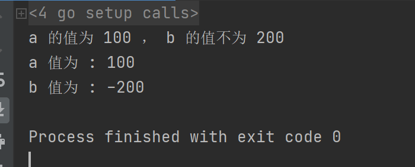
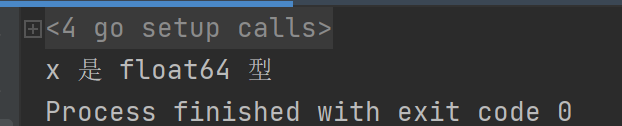
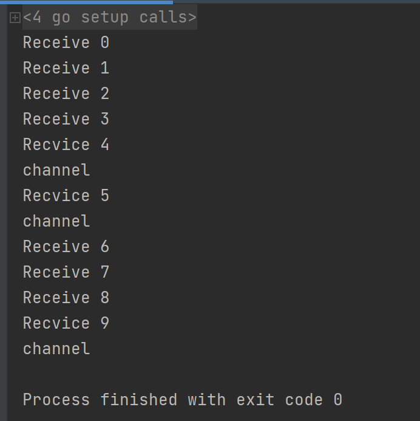
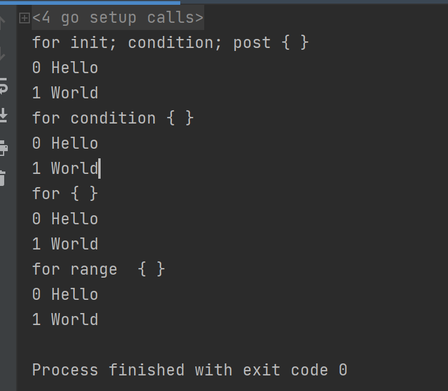
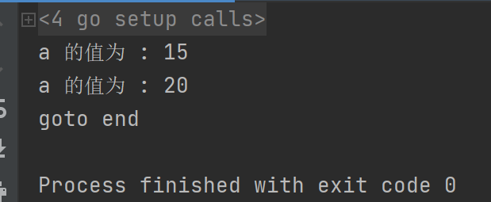

[TOC]

更多参见：[从0开始学GO之目录](https://blog.csdn.net/leacock1991/article/details/112853343)


## 条件语句

Go 语言提供了以下几种条件判断语句：

| 语句           | 描述                                                         |
| :------------- | :----------------------------------------------------------- |
| if 语句        | **if 语句** 由一个布尔表达式后紧跟一个或多个语句组成。       |
| if...else 语句 | **if 语句** 后可以使用可选的 **else 语句**, else 语句中的表达式在布尔表达式为 false 时执行。 |
| if 嵌套语句    | 你可以在 **if** 或 **else if** 语句中嵌入一个或多个 **if** 或 **else if** 语句。 |
| switch 语句    | **switch** 语句用于基于不同条件执行不同动作。                |
| select 语句    | **select** 语句类似于 **switch** 语句，但是select会随机执行一个可运行的case。如果没有case可运行，它将阻塞，直到有case可运行。 |

### if相关语句

```go
package main
import "fmt"

func main() {
	/* 定义局部变量 */
	var a int = 100
	var b int = -200

	/* 判断条件 */
	if a == 100 {
		/* if 条件语句为 true 执行 */
		if b+1 == 200 {
			/* if 条件语句为 true 执行 */
			fmt.Printf("a 的值为 100 ， b 的值为 200\n" )
		} else {
			/* if 条件语句为 false 执行 */
			fmt.Printf("a 的值为 100 ， b 的值不为 200\n" )
		}
	} else {
		fmt.Printf("a 的值不为 100\n" )
	}
	
	fmt.Printf("a 值为 : %d\n", a )
	fmt.Printf("b 值为 : %d\n", b )
}
```




### switch 语句

switch 语句用于基于不同条件执行不同动作，每一个 case 分支都是唯一的，从上至下逐一测试，直到匹配为止,匹配项后面也不需要再加 break。switch 默认情况下 case 最后自带 break 语句，匹配成功后就不会执行其他 case，如果我们需要执行后面的 case，可以使用 **fallthrough** 。(这一点和C/C++这些语言不同)

```go
package main
import "fmt"

func main() {
	/* 定义局部变量 */
	var grade string = "B"
	var marks int = 90

	switch marks {
	case 90: grade = "A"
	case 80: grade = "B"
	case 50,60,70 : grade = "C"
	default: grade = "D"
	}

	switch {
	case grade == "A" :
		fmt.Printf("优秀!\n" )
	case grade == "B", grade == "C" :
		fmt.Printf("良好\n" )
	case grade == "D" :
		fmt.Printf("及格\n" )
	case grade == "F":
		fmt.Printf("不及格\n" )
	default:
		fmt.Printf("差\n" )
	}
	fmt.Printf("你的等级是 %s\n", grade )
}
```

switch 语句还可以被用于 type-switch 来判断某个 interface 变量中实际存储的变量类型。

```go
package main
import "fmt"

func main() {
	var x interface{}
	x = 3.14
	switch i := x.(type) {
	case nil:
		fmt.Printf(" x 的类型 :%T",i)
	case int:
		fmt.Printf("x 是 int 型")
	case float64:
		fmt.Printf("x 是 float64 型")
	case func(int) float64:
		fmt.Printf("x 是 func(int) 型")
	case bool, string:
		fmt.Printf("x 是 bool 或 string 型" )
	default:
		fmt.Printf("未知型")
	}
	// x 是 float64 型
}
```




参见  [理解Golang中的interface和interface{}](https://www.cnblogs.com/maji233/p/11178413.html)

### select 语句

select 是 Go 中的一个控制结构，类似于用于通信的 switch 语句。每个 case 必须是一个通信操作，要么是发送要么是接收。

select **随机执行**一个可运行的 case。如果没有 case 可运行，它将阻塞，直到有 case 可运行。一个默认的子句应该总是可运行的。

```go
package main

import (
	"fmt"
	"time"
)

func Chann(ch chan int, stopCh chan bool) {

	for j := 0; j < 10; j++ {
		ch <- j
		time.Sleep(time.Second)
	}
	stopCh <- true
}

func main() {

	ch := make(chan int)
	c := 0
	stopCh := make(chan bool)

	go Chann(ch, stopCh)

	for true {
		select {
			case c = <-ch:
				fmt.Println("Recvice", c)
				fmt.Println("channel")
			case s := <-ch:
				fmt.Println("Receive", s)
			case _ = <-stopCh:
				goto end
		}
	}
end:
}
```




case c = <-ch: 与 case s := <-ch: 随机执行，每次运行的打印结果会不同


## 循环语句


| 循环类型 | 描述                                 |
| :------- | :----------------------------------- |
| for 循环 | 重复执行语句块                       |
| 循环嵌套 | 在 for 循环中嵌套一个或多个 for 循环 |


### for 循环

for 循环是一个循环控制结构，可以执行指定次数的循环。

Go 语言的 For 循环有 3 种形式，只有其中的一种使用分号。

和 C 语言的 for 一样：

```go
for init; condition; post { }
```

和 C 的 while 一样：

```go
for condition { }
```

和 C 的 for(;;) 一样：

```go
for { }
```

- init： 一般为赋值表达式，给控制变量赋初值；
- condition： 关系表达式或逻辑表达式，循环控制条件；
- post： 一般为赋值表达式，给控制变量增量或减量。

for 循环的 range 格式可以对 slice、map、数组、字符串等进行迭代循环。格式如下：

```go
for key, value := range oldMap {
    newMap[key] = value
}
```
示例：
```go
package main
import "fmt"

func main() {
	strings := []string{"Hello", "World"}
	// for init; condition; post { }
	fmt.Println("for init; condition; post { }")
	for i := 0 ;i<len(strings);i++ {
		fmt.Println(i, strings[i])
	}
	// for condition { }
	fmt.Println("for condition { }")
	i := 0
	for i < len(strings) {
		fmt.Println(i, strings[i])
		i++
	}
	// for { }
	fmt.Println("for { }")
	i = 0
	for {
		if i>=len(strings)  {
			break
		}
		fmt.Println(i, strings[i])
		i++
	}
	// for range  { }
	fmt.Println("for range  { }")
	for i, s := range strings {
		fmt.Println(i, s)
	}
}
```




**无限循环**

```go
    for true  {
        fmt.Printf("这是无限循环。\n");
    }
```


## 循环控制语句

循环控制语句可以控制循环体内语句的执行过程。

GO 语言支持以下几种循环控制语句：

| 控制语句      | 描述                                                   |
| :------------ | :----------------------------------------------------- |
| break 语句    | 经常用于中断当前 for 循环或跳出 switch 语句            |
| continue 语句 | 跳过当前循环的剩余语句，然后继续进行下一轮循环。       |
| goto 语句     | 将控制转移到被标记的语句。必须在当前函数内定义的标签： |

### continue 与 goto 

示例：

```go
package main
import "fmt"

func main() {
	/* 定义局部变量 */
	a := 0
	/* for 循环 */
	for true {
		if a == 15 {
			/* 跳过此次循环 */
			fmt.Printf("a 的值为 : %d\n", a)
			a++
			continue
		}
		if a == 20 {
			fmt.Printf("a 的值为 : %d\n", a)
			goto end
		}
		a++
	}
end:
	fmt.Println("goto end")
}
```




## 参考：

[https://www.runoob.com/go/go-decision-making.html](https://www.runoob.com/go/go-decision-making.html)

[https://www.runoob.com/go/go-loops.html](https://www.runoob.com/go/go-loops.html)

个人能力有限，如有错误或者其他建议，敬请告知欢迎探讨，谢谢!