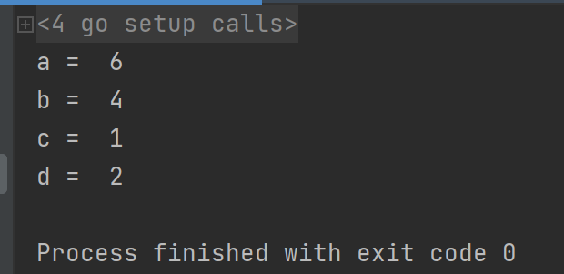
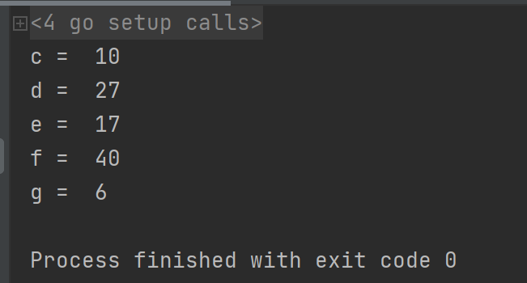

[TOC]

更多参见：[从0开始学GO之目录](https://blog.csdn.net/leacock1991/article/details/112853343)

Go 语言内置的运算符有：

- 算术运算符
- 关系运算符
- 逻辑运算符
- 位运算符
- 赋值运算符
- 其他运算符


## 算术运算符


| 运算符 |        描述        |   示例   | 结果 |
| :----: | :----------------: | :------: | :--: |
|   +    |         加         |   5+2    |  7   |
|   -    |         减         |   5-2    |  3   |
|   *    |         乘         |   5*2    |  10  |
|   /    |         除         |   5/2    |  2   |
|   %    |        取余        |   5%2    |  1   |
|   ++   | 后自增，没有前自增 | a:=5;a++ |  6   |
|   --   | 后自减，没有前自减 | b:=5;b-- |  4   |

```go
package main
import "fmt"

func main() {
	a:=5;a++
	fmt.Println("a = ",a) // a =  6
	b:=5;b--
	fmt.Println("b = ",b) // b =  4
	c := b / 3
	fmt.Println("c = ",c) // c =  1
	d := a % 4
	fmt.Println("d = ",d) // d =  2
}
```




## 关系运算符

| 运算符 |        描述        |   示例   | 结果 |
| :----: | :----------------: | :------: | :--: |
| == | 相等于 | 5==6 | false |
| != | 不等于 | 5!=6 | true |
| < | 小于 | 5<6 | true |
| > | 大于 | 5>6 | false |
| <= | 小于等于 | 5<=6 | true |
| >= | 大于等于 | 5>=6 | false |

## 逻辑运算符


| 运算符 |        描述        |   示例   | 结果 |
| :----: | :----------------: | :------: | :--: |
| ! | 非 | !a | 如果a为假，则!a为真；如果a为真，则!a为假 |
| && | 与 | a&&b | 如果a和b都为真，则结果为真，否则为假 |
| \|\| | 或 | a\|\|b | 如果a和b有一个为真，则结果为真，二者都为假时，结果为假 |

## 位运算符

位运算符对整数在内存中的二进制位进行操作。a = 10 , b = 27

| 运算符 |        描述        |   示例   | 结果 |
| :----: | :----------------: | :------: | :--: |
| & | 按位与 | a&b | 10 |
| \| | 按位或 | a\|b | 27 |
| ^ | 异或 | a^b | 17 |
| << | 左移,左边丢弃，右边补0 | a<<2 | 40 |
| >> | 右移,右边丢弃，左边补位。 | b>>2 | 6 |

```go
package main
import "fmt"

func main() {
	a:=10
	b:=27
	c := a & b // c =  10  	1010 & 11011 -> 01010 = 10
	d := a | b // d =  27	1010 | 11011 -> 11011 = 27
	e := a ^ b // e =  17	1010 ^ 11011 -> 10001 = 17
	f := a << 2 // f =  40  1010 << 2 -> 101000 = 40
	g := b >> 2 // g =  6   11011 >>2 -> 110 = 6
	fmt.Println("c = ",c)
	fmt.Println("d = ",d)
	fmt.Println("e = ",e)
	fmt.Println("f = ",f)
	fmt.Println("g = ",g)
}
```




## 赋值运算符

| 运算符 | 说明           | 示例                                  |
| ------ | -------------- | ------------------------------------- |
| =      | 普通赋值       | c = a + b 将 a + b 表达式结果赋值给 c |
| +=     | 相加后再赋值   | c += a 等价于 c = c + a               |
| -=     | 相减后再赋值   | c -= a 等价于 c = c - a               |
| *=     | 相乘后再赋值   | c *= a 等价于 c = c* a                |
| /=     | 相除后再赋值   | c /= a 等价于 c = c / a               |
| %=     | 求余后再赋值   | c %= a 等价于 c = c % a               |
| <<=    | 左移后赋值     | c <<= 2 等价于 c = c << 2             |
| >>=    | 右移后赋值     | c >>= 2 等价于 c = c >> 2             |
| &=     | 按位与后赋值   | c &= 2 等价于 c = c & 2               |
| ^=     | 按位异或后赋值 | c ^= 2 等价于 c = c ^ 2               |
| \|=    | 按位或后赋值   | c \|= 2 等价于 c = c \| 2             |


## 其他运算符

| 运算符 | 术语         | 示例 | 说明                    |
| ------ | ------------ | ---- | ----------------------- |
| &      | 取地址运算符 | &a   | 变量a的地址             |
| *      | 取值运算符   | *a   | 指针变量a所指向内存的值 |

## 运算符优先级

有些运算符拥有较高的优先级，二元运算符的运算方向均是从左至右。下表列出了所有运算符以及它们的优先级，由上至下代表优先级由高到低：

| 优先级 | 运算符           |
| :----- | :--------------- |
| 5      | * / % << >> & &^ |
| 4      | + - \| ^         |
| 3      | == != < <= > >=  |
| 2      | &&               |
| 1      | \|\|             |

## 参考：

[https://www.runoob.com/go/go-operators.html](https://www.runoob.com/go/go-operators.html)


个人能力有限，如有错误或者其他建议，敬请告知欢迎探讨，谢谢!